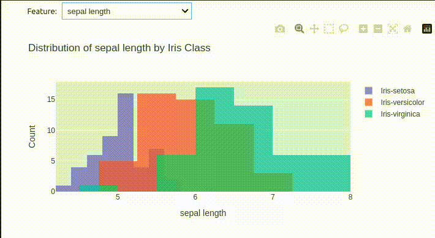
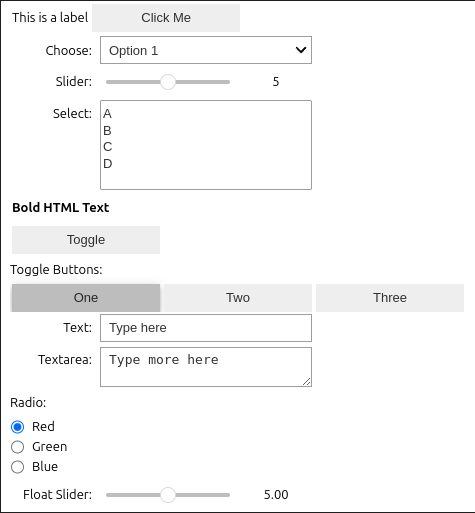
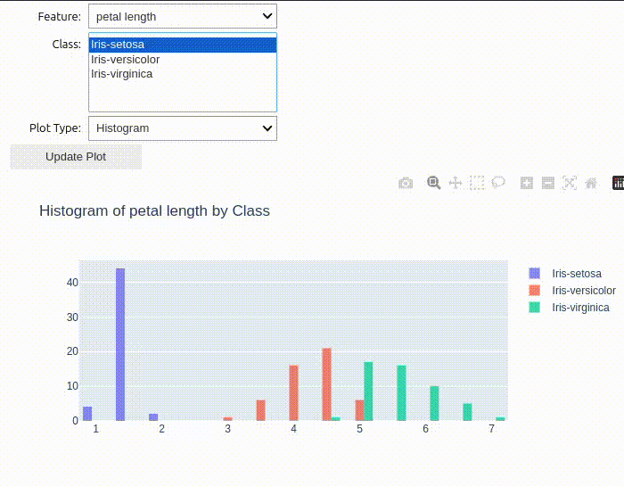

# Interactive Plots using Plotly and Ipywidgets
The aim of this repository is to create a small template which shows how to make interactive plots using plotly and ipywidgets in jupyter notebooks. This can be used as a starting point for further interactive data analysis.

## Imports and Dataset loading
Before we start with the interactive plots here are some imports of libraries we will use. Further the `Iris` dataset is loaded into a pandas dataframe. This dataset is used as an example here. Of course everything can be adapted to any other dataset.

```python
import plotly.graph_objects as go
import ipywidgets as widgets
import pandas as pd
df_samples = pd.read_csv(
    "https://ocw.mit.edu/courses/15-097-prediction-machine-learning-and-statistics-spring-2012/89d88c5528513adc4002a1618ce2efb0_iris.csv",
    names=[
        "sepal length", 
        "sepal width",
        "petal length",
        "petal width",
        "class",
    ]
)
```

## First Interactive Plot
Here is a small example on how to plot the distribution of the different features of the iris dataset. We want to make a histogram, which shows the distribution for a single feature for the different classes. The feature should be selectable via a dropdown menu.

```python
figure1 = go.FigureWidget()
dropdown_feature1 = widgets.Dropdown(
    options=df_sample.columns[:-1],  # exclude the class column
    value="sepal length",  # default value
    description="Feature:",
)


def update_histogram(_):
    feature = dropdown_feature1.value
    figure1.data = []  # Clear existing data
    for iris_class in df_sample["class"].unique():
        filtered_df = df_sample[df_sample["class"] == iris_class]
        histogram = go.Histogram(x=filtered_df[feature], name=iris_class, opacity=0.75)
        figure1.add_trace(histogram)
    figure1.update_layout(
        title=f"Distribution of {feature} by Iris Class",
        xaxis_title=feature,
        yaxis_title="Count",
        barmode="overlay",
    )


dropdown_feature1.observe(update_histogram, names="value")
update_histogram(None)  # Initial plot

widgets.VBox([dropdown_feature1, figure1])
```


## That's it!
Congratulations you created your first interactive plot!

Of course plotly and ipywidgets allow us to make much more stuff. Here are a few examples:

```python
widgets.VBox([ # arrange widgets vertically
    widgets.HBox([ # arrange widgets horizontally
        widgets.Label("This is a label"), 
        widgets.Button(description="Click Me")
    ]),
    widgets.Dropdown(options=["Option 1", "Option 2", "Option 3"], description="Choose:"),
    widgets.IntSlider(value=5, min=0, max=10, description="Slider:"),
    widgets.SelectMultiple(options=["A", "B", "C", "D"], description="Select:"),
    widgets.HTML(value="<b>Bold HTML Text</b>"),
    widgets.ToggleButton(value=False, description="Toggle"),
    widgets.ToggleButtons(options=["One", "Two", "Three"], description="Toggle Buttons:"),
    widgets.Text(value="Type here", description="Text:"),
    widgets.Textarea(value="Type more here", description="Textarea:"),
    widgets.RadioButtons(options=["Red", "Green", "Blue"], description="Radio:"),
    widgets.FloatSlider(value=5, min=0, max=10, description="Float Slider:"),
])
```


Of course there are much more widgets available, for a full list see the documentation [https://ipywidgets.readthedocs.io](https://ipywidgets.readthedocs.io/en/latest/examples/Widget%20List.html)

## Even more plots
Now we do not just want to select the feature, but also for what class(es) the distribution should be shown and what kind of plot to use.

```python
figure = go.FigureWidget()
dropdown_feature = widgets.Dropdown(
    options=[
        "sepal length",
        "sepal width",
        "petal length",
        "petal width"
    ],
    value="sepal length",
    description="Feature:",
)
multi_select_class = widgets.SelectMultiple(
    options=df_sample["class"].unique().tolist(),
    value=[df_sample["class"].unique().tolist()[0]],
    description="Class:",
)
dropdown_plot_type = widgets.Dropdown(
    options=["Histogram", "Box", "Violin", "Pie", "Scatter"],
    value="Histogram",
    description="Plot Type:",
)
button_update = widgets.Button(description="Update Plot")

def update_plot(_):
    feature = dropdown_feature.value
    selected_classes = multi_select_class.value
    plot_type = dropdown_plot_type.value
    figure.data = []  # Clear existing data

    for iris_class in selected_classes:
        filtered_df = df_sample[df_sample["class"] == iris_class]
        if plot_type == "Histogram":
            trace = go.Histogram(
                x=filtered_df[feature],
                name=iris_class,
                opacity=0.75
            )
        elif plot_type == "Box":
            trace = go.Box(
                y=filtered_df[feature],
                name=iris_class
            )
        elif plot_type == "Violin":
            trace = go.Violin(
                y=filtered_df[feature],
                name=iris_class
            )
        elif plot_type == "Pie":
            trace = go.Pie(
                labels=filtered_df[feature],
                name=iris_class,
                hole=0.3
            )
        elif plot_type == "Scatter":
            trace = go.Scatter(
                x=[1]*len(filtered_df),
                y=filtered_df[feature],
                mode='markers',
                name=iris_class
            )
        figure.add_trace(trace)
    figure.update_layout(title=f"{plot_type} of {feature} by Class")
    figure.show()

button_update.on_click(update_plot)
update_plot(None)  # Initial plot

widgets.VBox([
    dropdown_feature,
    multi_select_class,
    dropdown_plot_type,
    button_update,
    figure
])
```


Of course you can use all available `plotly.graph_objects` plots. For a complete list see the `plotly` documentation: [https://plotly.com/python-api-reference/plotly.graph_objects.html](https://plotly.com/python-api-reference/plotly.graph_objects.html)


## Contribution
If you find this template useful, please consider starring the repository. Contributions are welcome — open an issue or submit a pull request if you have improvements, examples, or fixes. This repo is meant as a starting point and should grow into a helpful collection of tips and examples.